# ECL Slide Diagrams (Mermaid)

## Slide 5: ECL Workflow Diagram

```mermaid
flowchart LR
    subgraph EXTRACT["1️⃣ EXTRACT"]
        A[📄 Documents] --> B[🔍 MoE Experts]
    end
    
    subgraph BUILD["2️⃣ BUILD"]
        B --> C[📊 Entities]
        C --> D[🔗 Relationships]
    end
    
    subgraph LINK["3️⃣ LINK"]
        D --> E[(🗄️ FalkorDB)]
        E --> F[🤖 MCP Tools]
    end
    
    style EXTRACT fill:#e3f2fd
    style BUILD fill:#f3e5f5
    style LINK fill:#e8f5e9
```

## Slide 9: Enterprise AI Data Stack (6 Layers)

```mermaid
flowchart TB
    subgraph CONSUMPTION["🎯 CONSUMPTION"]
        C1[AI Agents]
        C2[Copilots]
        C3[RAG Apps]
        C4[Dashboards]
    end
    
    subgraph ORCHESTRATION["⚙️ ORCHESTRATION"]
        O1[MCP Tools]
        O2[Agent APIs]
        O3[Query Engine]
        O4[Guardrails]
    end
    
    subgraph KNOWLEDGE["🧠 KNOWLEDGE"]
        K1[(Graph DB<br/>FalkorDB/Neo4j)]
        K2[(Vector Store)]
        K3[Ontology]
    end
    
    subgraph EXTRACTION["🔍 EXTRACTION - ECL Zone"]
        X1[MoE Experts]
        X2[Entity Recognition]
        X3[Relationship Detection]
        X4[LLM + Rules]
    end
    
    subgraph INGESTION["📥 INGESTION"]
        I1[ETL Pipelines]
        I2[Streaming]
        I3[File Loaders]
        I4[OCR/Vision]
    end
    
    subgraph SOURCES["📂 DATA SOURCES"]
        S1[(Databases)]
        S2[APIs]
        S3[Documents]
        S4[IoT/Sensors]
        S5[Images]
    end
    
    SOURCES --> INGESTION
    INGESTION --> EXTRACTION
    EXTRACTION --> KNOWLEDGE
    KNOWLEDGE --> ORCHESTRATION
    ORCHESTRATION --> CONSUMPTION
    
    style CONSUMPTION fill:#c8e6c9
    style ORCHESTRATION fill:#b3e5fc
    style KNOWLEDGE fill:#e1bee7
    style EXTRACTION fill:#ffccbc,stroke:#ff5722,stroke-width:3px
    style INGESTION fill:#ffe0b2
    style SOURCES fill:#f5f5f5
```

## Slide 10: ECL Technical Stack

```mermaid
flowchart LR
    DOC[📄 Tower Report] --> MOE[🧠 MoE Experts]
    MOE --> |ContractExpert| ENT[📦 Entities]
    MOE --> |EquipmentExpert| ENT
    MOE --> |RiskExpert| ENT
    MOE --> |OpportunityExpert| ENT
    
    ENT --> LLM[🤖 Ollama LLM]
    LLM --> GRAPH[(FalkorDB)]
    GRAPH --> MCP[🔧 MCP Server]
    MCP --> AGENT[AI Agent]
    
    style DOC fill:#fff3e0
    style GRAPH fill:#e8f5e9
    style AGENT fill:#e3f2fd
```

## Slide 6: ETL vs ECL Comparison

---

## Usage
Copy these mermaid blocks into:
- Mermaid.live for PNG export
- Notion/Obsidian for rendering
- Reveal.js/Slidev presentations
